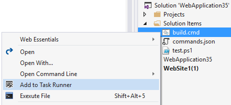

# Command Task Runner extension

Adds support for command line batch files in Visual Studio 2015's
Task Runner Explorer. Supports `.cmd`, `.bat`, `.ps1` and `.psm1` files.

[](https://ci.appveyor.com/project/madskristensen/commandtaskrunner)

Download the extension at the
[VS Gallery](https://visualstudiogallery.msdn.microsoft.com/e6bf6a3d-7411-4494-8a1e-28c1a8c4ce99)
or get the
[nightly build](http://vsixgallery.com/extension/fc1aafb2-321e-41bd-ac37-03b09ea8ef31/)

## Add commands

The easiest way to add a batch file to Task Runner Explorer
is to right-click it in Solution Explorer and select
**Add to Task Runner**



You can right-click supported batch files in either solution
folders or from within a any project.

Doing so will create a `commands.json` file. If you right-clicked
a batch file in a solution folder, then the `commands.json`
file will be placed in the solution folder. If the batch file
is in a project you will be prompted to select to either
put it in the project or solution folder.

If a `commands.json` file already exist, the new batch
file will be added.

## Execute scripts

When scripts are specified, the Task Runner Explorer
will show those scripts.


Each script can be executed by double-clicking the task.

## commands.json locations

The Task Runner Explorer supports multiple task runners in the
same solution. For instance, you can have commands specified
for the solution and additional ones for each project in that
solution.

Task Runner Explorer will try to find a `commands.json` file
in any parent folder to either the individual projects or
the solution until it hits the root of the drive.

## Commands

Inside commands.json it is possible to add custom scripts inside
the "scripts" element.

```js
{
	"commands": {
		"Build": {
			"FileName": "cmd.exe",
			"WorkingDirectory": ".",
			"Arguments": "/c build\\build.cmd"
		}
	}
}
```

## Commands with no batch file

You can execute any command inside `commands.json` by manually
editing it. A batch file is not needed if you just need to
execute simple commands.

## Drag and drop

You can drag any supported batch file onto `commands.json`
to add it. Just keep in mind that Visual Studio doesn't support
drag and drop from solution folders.

## Bindings

Script bindings make it possible to associate individual scripts
with Visual Studio events such as "After build" etc.


## Intellisense

If you manually edit bindings in `command.json``,
then full Intellisense is provided.


## Open Command Line

For the optimal experience with batch file and Visual Studio, try
the free
[Open Command Line](https://visualstudiogallery.msdn.microsoft.com/4e84e2cf-2d6b-472a-b1e2-b84932511379)
extension for even more features.

## Contribute
Check out the [contribution guidelines](.github/CONTRIBUTING.md)
if you want to contribute to this project.

For cloning and building this project yourself, make sure
to install the
[Extensibility Tools 2015](https://visualstudiogallery.msdn.microsoft.com/ab39a092-1343-46e2-b0f1-6a3f91155aa6)
extension for Visual Studio which enables some features
used by this project.

## License
[Apache 2.0](LICENSE)