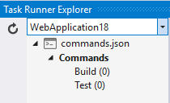
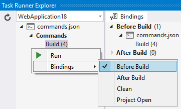
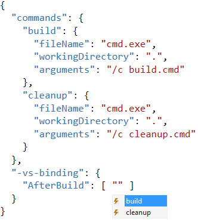

## DNX Scripts Task Runner extension

Adds support for DNX scripts in Visual Studio 2015's
Task Runner Explorer.

[](https://ci.appveyor.com/project/madskristensen/projecttaskrunner)

Download the extension at the
[VS Gallery](https://visualstudiogallery.msdn.microsoft.com/9397a2da-c93a-419c-8408-4e9af30d4e36)
or get the
[nightly build](http://vsixgallery.com/extension/ec768980-f2de-4db0-a6e2-5e57fa612ad5/)

### DNX scripts

Inside project.json it is possible to add custom scripts inside
the "scripts" element.

```js
{
	"scripts": {
		"postbundle": [ "npm install", "bower install" ],
		"postpack": "npm install"
	}
}
```

### Execute scripts

When scripts are specified, the Task Runner Explorer
will show those scripts.



Each script can be executed by double-clicking the task.

### Bindings

Script bindings make it possible to associate individual scripts
with Visual Studio events such as "After build" etc.



### Intellisense

If you manually edit bindings in project.json, then full
Intellisense is provided.

